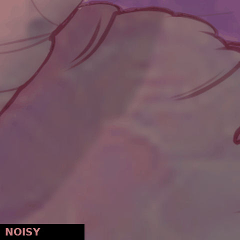
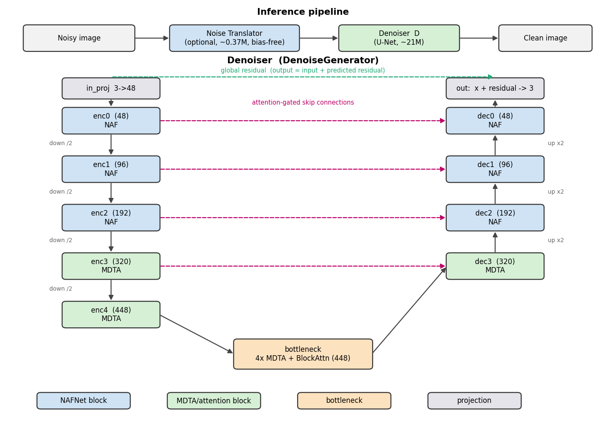
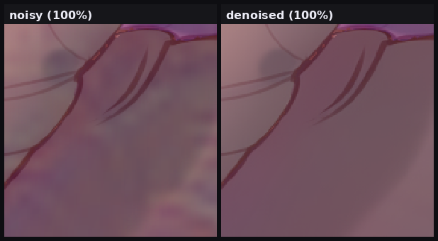
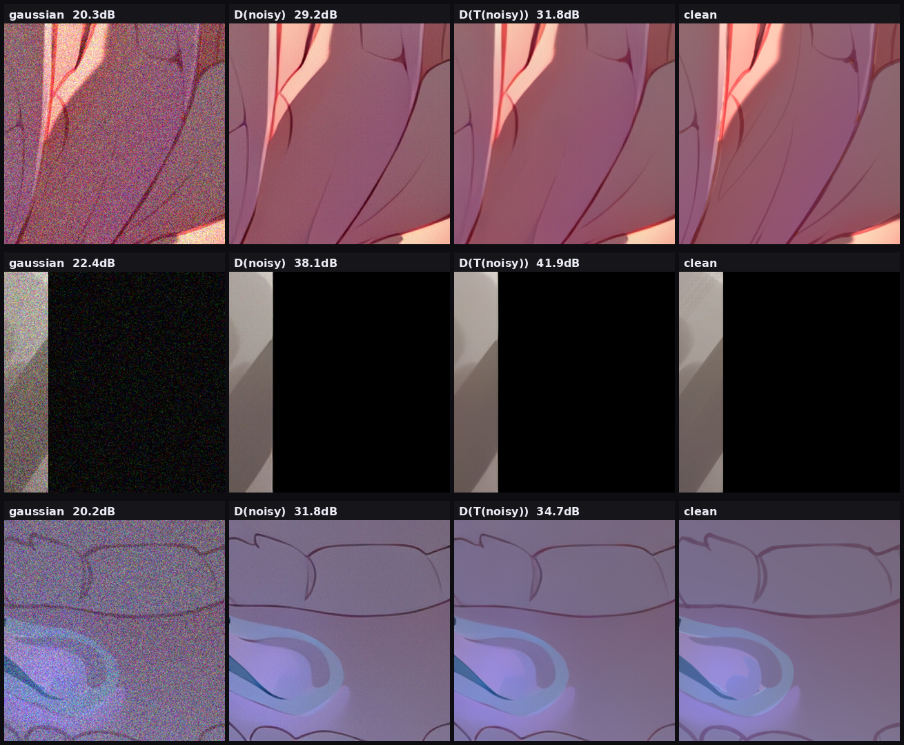
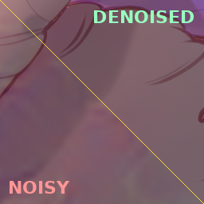

# DenoiseGAN

A single-step image denoiser focused on removing noise without destroying texture,
together with a small optional "noise translator" front-end that adapts the denoiser
to noise it wasn't trained on.

The shipped model is the reconstruction (PSNR) stage. I also tried an adversarial
(GAN) stage; it didn't improve results, so it isn't part of the released weights. See
[Notes](#notes).



## Architecture



The denoiser (`DenoiseGenerator`, ~21M parameters) is a U-Net. The encoder/decoder
stages near full resolution use NAFNet-style gated convolution blocks; the deeper
stages and bottleneck use Restormer-style transposed self-attention (MDTA) and gated
feed-forward (GDFN) blocks. Skip connections are attention-gated, and the output is a
residual: the network predicts the noise to subtract, with a zero-initialized output
projection so it starts as an identity map and learns from there. Channels are
`(48, 96, 192, 320, 448)` across the five levels.

The noise translator (`NoiseTranslator`, ~0.37M parameters) is a small residual conv
stack with no biases and no normalization (ReLU only, plus a global residual). Removing
the biases makes it scale-equivariant, so it generalizes across noise magnitudes it
hasn't seen. It is trained through the frozen denoiser so that `D(T(noisy))` lands close
to clean — in other words it learns to convert unfamiliar noise into the kind the
denoiser already removes well. At inference the pipeline is `clean = D(T(noisy))`, and
the translator can be skipped for the noise the denoiser was trained on.

## Examples

Detail at 100% zoom, where the difference between removing noise and smearing texture
is visible:



Gaussian noise, translator off versus on (`noisy | D(noisy) | D(T(noisy)) | clean`, with
PSNR):



A single image split down the middle, noisy on one side and denoised on the other:



More comparisons across noise types and a frequency-domain view are in
`assets/noise_types.png`, `assets/denoise_real.png`, and `assets/fft_compare.png`.

## Install

```
pip install -r requirements.txt
```

A CUDA-capable GPU is recommended.

## Usage

Run the GUI, load a denoiser checkpoint, optionally load a translator, open an image,
and process it. Inference is tiled with Hann-window blending so arbitrary resolutions
work.

```
python gui.py
```

From Python:

```python
import torch
from models import DenoiseGenerator, NoiseTranslator

D = DenoiseGenerator(channels=(48, 96, 192, 320, 448), use_checkpoint=False).eval().cuda()
D.load_state_dict(torch.load('psnr_final.pt')['ema'], strict=False)

T = NoiseTranslator().eval().cuda()                  # optional
T.load_state_dict(torch.load('translator_0020000.pt')['ema'])

with torch.no_grad():
    out = D(T(noisy))      # noisy normalized to [-1, 1]; drop T for in-distribution noise
```

Weights are on Hugging Face at `orangepegasus/DenoiseGAN`
(`psnr_final.pt` and `translator_0020000.pt`).

## Training

Training has three stages in `train.py`:

- MIM: masked-image-modeling pretrain on clean images (masked Charbonnier loss).
- PSNR: supervised restoration with Charbonnier + focal-frequency + Lab-chroma +
  gradient-variance + LPIPS. This is the released denoiser.
- GAN: optional adversarial fine-tune (relativistic GAN with R1/R2, SOAP optimizer).

Degradations (`dataset.py`) use a Real-ESRGAN-style first/second-order pipeline plus
real-noise residual augmentation: the real noise is taken as `noisy - clean`, randomly
rescaled and transformed, and re-applied, so the model sees its true noise at many
intensities. `scan_clean_noise.py` flags target images that still contain residual noise
so they can be excluded.

The translator is trained separately against the frozen denoiser with
`train_noise_translator.py`, which logs losses, the PSNR/SSIM gain the translator
provides, residual maps, FFT spectra, and weight/gradient histograms to TensorBoard.

## Files

```
models.py                   DenoiseGenerator, NoiseTranslator, GuidedNoiseTranslator, discriminators
dataset.py                  paired loader, degradation pipeline, residual augmentation
losses.py                   Charbonnier, focal-frequency, Lab-chroma, gradient-variance, GAN losses
train.py                    MIM / PSNR / GAN stages
train_noise_translator.py   trains the translator through the frozen denoiser
gui.py                      tiled-inference GUI with optional translator and test-time adaptation
scan_clean_noise.py         flags noisy target images
```

## Notes

The GAN stage did not help here. It traded fidelity for hallucinated texture, while the
PSNR-stage model stayed cleaner and more faithful, so the released model is the PSNR
stage.

The denoiser is tuned for a specific family of noise and prioritizes keeping detail over
maximizing PSNR on any single benchmark. For Gaussian and other out-of-distribution
noise, enable the translator. The translator handles different noise on recoverable
signal; it cannot bring back detail the noise has already destroyed.

## License

MIT. See [LICENSE](LICENSE).
